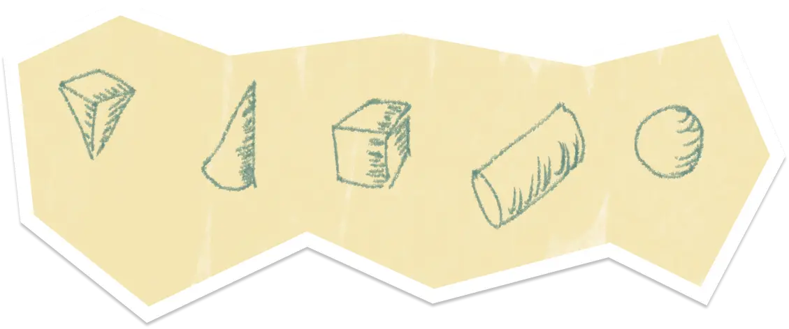
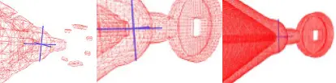
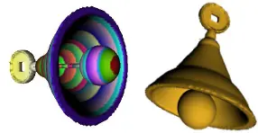

# Renda



It is one of the [NTU](https://www.ntu.edu.sg/)'s CZ2003 Computer Graphic and Visualisation Assignments

## What?

We are tasks to render an 3D object complex enough to apply all the basic shapes using a renderer software

## Why?

To understand how computer render 3D objects using mathematical equation.

## How?

1. Given the references visual object think of how basic shapes can be formed
2. Craft the basic 3D shapes and sizes
3. Composite and re-position them in 3D space
4. Adjust render complexity via wireframe view
5. Apply coloring

## Highlights

Render Object Equation

```
Max(min(0.2^2-x^2-
y^2,z,6-z), Max(1.5^2-
(x)^2 - (y)^2 - (z-6)^2, Min(Max(Min(4.2^2-(x)^2 - (y)^2 - (z-7)^2, -z+6), Min(-z+6,5^2-(x)^2 -
(y)^2 - (z-8.5)^2),
Max(Max(1^2-(x/0.5)^2 -(y/0.5)^2 - (z+0.7)^2, Max(Max(Min(Min(1.5^2-(y)^2-(3+z)^2,0.1-
x,0.1+x),- Min(1.5^2-
(y)^2-(3+z)^2,0.1-
x,0.1+x)), Min
(Min(1.6^2-(y)^2-
(3+z)^2,0.3-x,0.3+x),-1.4^2-(y)^2-(3+z)^2)), Min(Min(-z-2.5, z+3.5, 0.5-y, 0.5+y, 0.2-x,
0.2+x),- Min(z-
2.6,z+3.4,0.4-y,0.4+y)))), Max(Min(z,4-z, (x)^2 +
(y)^2 -(((z)*0.5)+0.7)^2)), Min(z,4-z, (x)^2 + (y)^2 -(((z)*0.5)+0.7)^2)));),-Min(z,7-z, (x)^2 + (y)^2 -(((z-1)*0.6)+0.7)^2)) >= 0;) >= 0
```

Render Object View




References


## Disclaimer

All external data and assets used in this project is intended for educational purpose only.

## Contributor

Renda Team
